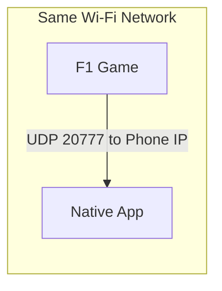

# F1 Game Telemetry — Native Mobile App Plan

## Context

- **Goal:** Phone-only telemetry for F1 game (no PC required when using PS5/Xbox).
- **Key insight:** Native apps can receive raw UDP. The phone listens on port 20777; the game sends telemetry to the phone's IP.
- **Platforms supported:** PC, PS5, Xbox — all send UDP to a configurable IP (the phone).
- **Existing assets:** `[TelemetryPanel](src/components/live/telemetry-panel.tsx)` and `CarData` shape can inform the mobile UI (speed, RPM, throttle, brake, gear, DRS).
- **Scope:** iOS only for now. Android can be added later.

---

## Architecture Overview




**User flow (phone + console):**

1. Phone and console (PS5/Xbox) on same Wi-Fi.
2. User installs F1 Dashboard mobile app.
3. App displays phone's IP (e.g. `192.168.1.105`) and setup steps.
4. User configures game: UDP Telemetry On, UDP IP = phone's IP.
5. App listens on UDP port 20777, receives packets, parses and displays telemetry in real time.
6. No PC or relay required.

---

## User Experience (UX)

### First Launch / Setup Screen

- **On open:** App requests local network permission (iOS).
- **Primary content:** Large, easy-to-copy display of the phone's local IP (e.g. `192.168.1.105`). Tap to copy.
- **Step-by-step instructions:**
  1. Ensure your phone and game console/PC are on the same Wi-Fi.
  2. In the F1 game: Settings → Telemetry (or similar).
  3. Turn UDP Telemetry On.
  4. Set UDP IP to the address shown above.
  5. Set UDP Port to 20777 (default).
  6. Set UDP Format to 2024 or 2025 depending on your game version.
  7. Enter a session (Practice, Qualifying, or Race). Telemetry will appear here.
- **CTA:** "Start Listening" or automatic listen on screen load. Status: "Waiting for telemetry…"

### Main Telemetry Screen

- **Layout:** Portrait-optimized, glanceable. Large digits for speed and gear; bars for throttle and brake.
- **Data shown:** Speed (km/h), RPM, Throttle %, Brake %, Gear, DRS (On/Off).
- **Visual style:** Dark theme by default (matches in-game/racing feel); high contrast for visibility.
- **Updates:** Real-time (20 Hz from game); smooth transitions between values.

### Connection States


| State                 | What user sees                                                              |
| --------------------- | --------------------------------------------------------------------------- |
| **Listening**         | "Listening on port 20777. Configure your game to send telemetry to [IP]."   |
| **Receiving**         | Live telemetry gauges; subtle "Connected" indicator.                        |
| **No data (timeout)** | "No telemetry received. Check that the game is running and UDP is enabled." |
| **Permission denied** | "Local network access is required. Enable in Settings."                     |
| **Wrong network**     | Hint: "Phone and game must be on the same Wi-Fi."                           |


### Interactions

- **Copy IP:** Tap IP address to copy to clipboard; toast: "Copied."
- **Refresh IP:** Pull-to-refresh or manual refresh if user switches networks.
- **Back to setup:** Link or button to return to instructions if telemetry never arrives.
- **Keep screen on:** Option to prevent sleep while viewing telemetry (optional toggle).

### Typical Session Flow

1. User opens app → sees setup screen with IP.
2. User copies IP, switches to game, configures UDP, enters session.
3. User returns to app (or has it on a stand beside TV). Telemetry appears.
4. User drives; values update in real time.
5. Session ends or user leaves; telemetry stops; "Waiting for telemetry…" reappears when no packets for a few seconds.

### Edge Cases

- **App backgrounded:** Continue receiving if possible; otherwise show "Resume" / "Reconnect" on return.
- **Network change:** Detect new IP, update display, prompt user to reconfigure game if needed.
- **Multiple devices:** Game sends to one IP only; no multi-device sync in v1.

---

## Technology Choice: React Native

**Recommended:** React Native (Expo with development build, or bare workflow).

- Existing dashboard is React/TypeScript — mobile app can mirror types; with Option A, parser and types live inside `mobile/`.
- `react-native-udp` or similar packages enable UDP sockets.
- iOS first; Android later.
- Can evolve into a full F1 dashboard app (standings, calendar, news, etc.) over time.

**Alternatives:**


| Framework           | Pros                    | Cons                       |
| ------------------- | ----------------------- | -------------------------- |
| Flutter             | UDP support, performant | Separate Dart codebase     |
| Capacitor           | Wrap web UI             | Requires native UDP plugin |
| Native Swift/Kotlin | Full control            | Two codebases              |


---

## Implementation Plan

### Phase 1: Parser and Types (inside mobile/)

- Add `mobile/src/lib/types.ts` and `mobile/src/lib/parser.ts`:
  - `GameTelemetry` type (speed, rpm, throttle, brake, n_gear, drs) compatible with existing `CarData` shape.
  - F1 UDP packet parser — port logic from `@deltazeroproduction/f1-udp-parser` to pure JS (no Node deps), or implement minimal parser from [official UDP spec](https://forums.ea.com/discussions/f1-25-general-discussion-en/f1-2025-udp-specification/12082129). Key packet: `PacketCarTelemetryData` (id 6).
- Parser must run in React Native (use `react-native-udp` or `react-native-dgram` for the socket, not Node `dgram`).

### Phase 2: React Native App Scaffold

- Create `mobile/` as a sibling folder to `src/` with its own `package.json` (no root workspace linkage).
- Install UDP library: `react-native-udp` or equivalent.
- Create UDP listener hook: bind to `0.0.0.0:20777`, on `message` parse packet and update state.
- Build minimal Game Telemetry screen: gauges for speed, RPM, throttle, brake, gear, DRS (reuse design from web `TelemetryPanel`).

### Phase 3: Setup Flow and UX

- **Setup screen:** Show phone's local IP, step-by-step in-game instructions (UDP On, IP, port 20777, format 2024/2025).
- **Connection status:** "Listening" vs "Receiving data".
- **Empty state:** "Configure your game to send telemetry to [IP]" when no data yet.
- Network permission handling (local network access for iOS).

### Phase 4: Polish and Distribution (iOS)

- Handle app backgrounding.
- Test on iOS with real console/PC game.
- Build and distribute via Expo EAS (see below).

### Phase 5 (Optional): Web Dashboard + Relay

- For users who prefer the web dashboard on PC: relay + `/game-telemetry` page.
- Mobile app remains primary for phone-only console users.

---

## Impact on Deployed Web App

**Short answer:** Pushing to GitHub will not break the website if we use Option A below.


| Aspect                   | Impact                                                   |
| ------------------------ | -------------------------------------------------------- |
| Existing deployment      | No change                                                |
| Existing features        | Unchanged (standings, calendar, live, game setups, etc.) |
| New functionality on web | Game Telemetry only if Phase 5 (relay) is implemented    |


The host (e.g. Vercel) runs `npm install` and `npm run build` from the root. We must keep the root Next.js project as the primary build target.

---

## Repo Structure: Safe vs Workspace

**Option A — No workspaces (recommended, safest)**

- Add `mobile/` as a sibling folder with its own `package.json`.
- Keep root `package.json` and Next.js config unchanged.
- Pushing to GitHub will not affect the web deploy; the host ignores the `mobile/` folder.
- The mobile app is self-contained. Shared types/parser live inside `mobile/` or a local `mobile/src/lib/` until we need cross-project sharing.

**Option B — Monorepo with workspaces**

- Add `workspaces` to root `package.json`, add `packages/f1-telemetry` and `apps/mobile`.
- Requires testing that `npm install` and `npm run build` still succeed locally and on the host.
- More setup; only use if you need shared packages between web and mobile.

**Recommendation:** Use Option A so the web app stays untouched. Option B can be adopted later if needed.

---

## Key Files / Structure (Option A)


| Path                                         | Action                                                   |
| -------------------------------------------- | -------------------------------------------------------- |
| `mobile/`                                    | New — React Native app (sibling to src/, self-contained) |
| `mobile/package.json`                        | New — Mobile app deps, no root workspace linkage         |
| `mobile/src/screens/GameTelemetryScreen.tsx` | New — Telemetry UI                                       |
| `mobile/src/hooks/useUdpTelemetry.ts`        | New — UDP listener + parser                              |
| `mobile/src/screens/SetupScreen.tsx`         | New — IP display + instructions                          |
| `mobile/src/lib/parser.ts`                   | New — F1 UDP CarTelemetry parser (pure JS/TS)            |
| `mobile/src/lib/types.ts`                    | New — GameTelemetry types                                |
| `mobile/eas.json`                            | New — EAS build config (from `eas build:configure`)      |
| `src/` (root)                                | Unchanged — Next.js web app                              |
| `package.json` (root)                        | Unchanged                                                |


---

## iOS Build and Distribution (Expo + EAS)

How to build the app for iOS and install it on your iPhone using Expo EAS and a free Apple ID. iOS only for now.

---

### Part A: Expo / EAS Setup and Build

**Why EAS:** Expo Go does not support native modules (UDP). EAS Build produces installable `.ipa` files in the cloud. Use a development or preview build profile for UDP support.

#### Step 1: Install EAS CLI

```bash
npm install -g eas-cli
```

#### Step 2: Create and log in to Expo account

1. Go to [expo.dev](https://expo.dev) and create an account.
2. Log in:

```bash
eas login
```

#### Step 3: Configure EAS in the mobile project

```bash
cd mobile
eas build:configure
```

Creates `eas.json` in `mobile/`.

#### Step 4: Build for iOS

```bash
eas build --platform ios --profile development
```

Or for a production-like internal build:

```bash
eas build --platform ios --profile preview
```

#### Step 5: Use your Apple ID when prompted

- EAS asks for iOS credentials.
- Choose **Use my own Apple ID**.
- Sign in with your Apple ID (free account is fine).
- EAS uses your Personal Team for signing.

#### Step 6: Install on iPhone

- When the build finishes, EAS shows a link (terminal and [expo.dev](https://expo.dev)).
- Open the link on your iPhone.
- Install the app; if needed, trust the profile in **Settings → General → VPN & Device Management**.

#### Example `eas.json` (in `mobile/`)

```json
{
  "build": {
    "development": {
      "developmentClient": true,
      "distribution": "internal",
      "ios": { "simulator": false }
    },
    "preview": {
      "distribution": "internal",
      "ios": { "simulator": false }
    }
  }
}
```

---

### Part B: Free Apple Developer Account (for signing)

Free Apple ID = no paid Apple Developer Program ($99/year). App expires after ~7 days; rebuild and reinstall to continue.

#### Step 1: Create an Apple ID

1. Go to [appleid.apple.com](https://appleid.apple.com).
2. Click **Create Your Apple ID**.
3. Enter email, password, name, date of birth.
4. Verify email with the code Apple sends.
5. Enable two-factor authentication when prompted.

#### Step 2: Install Xcode (Mac only)

1. Open **App Store** on your Mac.
2. Search for **Xcode** and install it.
3. Open Xcode once and accept the license.
4. Wait for additional components to finish installing.

#### Step 3: Add Apple ID in Xcode (optional but helpful)

1. Open **Xcode**.
2. Go to **Xcode → Settings** (or **Preferences**).
3. Open the **Accounts** tab.
4. Click **+** (bottom left) → **Apple ID** → **Continue**.
5. Sign in with your Apple ID.

You should see "Personal Team" or "Free". EAS uses this when you choose "Use my own Apple ID" during build.

#### Step 4: Trust the app on iPhone (first install)

1. After installing via EAS link, open the app on your iPhone.
2. If blocked: **Settings → General → VPN & Device Management**.
3. Tap your developer profile → **Trust**.

#### Step 5: 7-day expiry (free account)

- App stops opening after ~7 days.
- To continue: run `eas build --platform ios --profile development` again and reinstall via the new link.
- Or run via Xcode (see Part C).
- Upgrade to paid Apple Developer Program ($99/year) to remove the 7-day limit.

---

### Part C: Alternative — Run via Xcode (no EAS)

1. Add Apple ID in Xcode (Part B, Step 3).
2. Open `mobile/ios/YourApp.xcworkspace` in Xcode.
3. Select project → **Signing & Capabilities** → check **Automatically manage signing** → choose Personal Team.
4. Connect iPhone via USB.
5. Select iPhone from device menu → press **Run** (play).
6. On iPhone: **Settings → General → VPN & Device Management** → Trust your profile.

---

### Quick Reference: iOS Build Flow


| Step | Command / Action                                    |
| ---- | --------------------------------------------------- |
| 1    | `npm install -g eas-cli`                            |
| 2    | `eas login` (Expo account)                          |
| 3    | `cd mobile && eas build:configure`                  |
| 4    | `eas build --platform ios --profile development`    |
| 5    | When prompted: use your own Apple ID (free)         |
| 6    | Open build link on iPhone → Install → Trust profile |


---

## User Process Summary


| Scenario           | Steps                                                                         |
| ------------------ | ----------------------------------------------------------------------------- |
| Phone + PS5/Xbox   | Install app, see phone IP, set game UDP IP to that IP, app receives telemetry |
| Phone + PC game    | Same; game sends to phone IP (both on same Wi-Fi)                             |
| PC only (no phone) | Use web dashboard + relay (Phase 5) if implemented                            |


---

## Questions Before Implementation

1. **Expo vs bare:** Prefer Expo (easier) with dev build for native modules, or bare React Native?
2. **Scope:** Start with Game Telemetry only, or include basic nav for future expansion?

